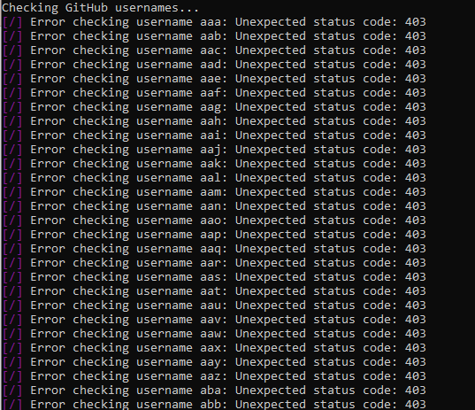

# GitHub Username Checker

This is a Python script that checks a list of GitHub usernames to see if they are available or taken. 

## Usage

1. Clone this repository to your local machine.
2. Create a file called `usernames.txt` in the same directory as the script.
3. Add a list of GitHub usernames, one per line, to the `usernames.txt` file.
4. Run the script using `python checker.py`.
5. The script will output a list of usernames and whether they are available or taken.

## Requirements

This script requires the `requests` and `colorama` Python packages to be installed. You can install them using the following command:

```pip install requests colorama```


## Example

Here's an example of what the output might look like:



## Contributing

If you would like to contribute to this project, please open a pull request or submit an issue.

## License

This project is licensed under the MIT License - see the LICENSE.md file for details.
